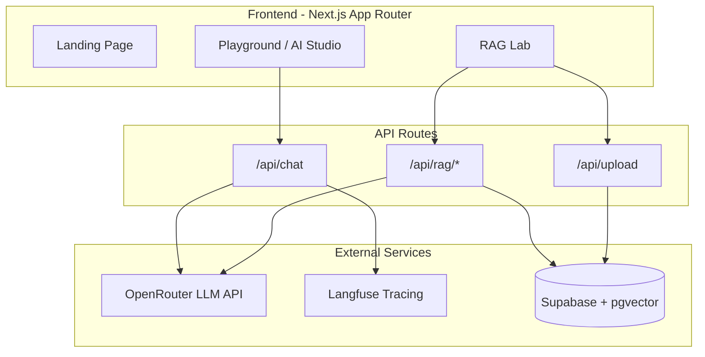

# AI Workshop Playground - Implementation Plan (Updated)

## Architecture Overview



**Supabase Project**: `tyttkpzwrlbxcbnfbdqa` (eu-west-1) - Database operations via Supabase MCP

---

## Project Structure

```
app/
├── page.tsx                          # Landing page
├── layout.tsx                        # Root layout with providers
├── globals.css                       # Tailwind + theme variables
├── playground/
│   └── page.tsx                      # AI Studio interface
├── rag-lab/
│   └── page.tsx                      # RAG Lab interface
└── api/
    ├── chat/route.ts                 # Main chat endpoint (streaming + non-streaming)
    ├── rag/
    │   ├── upload/route.ts           # File upload + configurable embedding
    │   ├── search/route.ts           # Vector similarity search
    │   └── chat/route.ts             # RAG-enhanced chat
    └── cag/
        └── chat/route.ts             # Context-stuffing chat (for comparison)

components/
├── ui/                               # shadcn/ui components
├── playground/
│   ├── chat-interface.tsx
│   ├── model-selector.tsx            # Includes reasoning effort for thinking models
│   ├── temperature-slider.tsx
│   ├── system-prompt-editor.tsx
│   ├── feature-toggles.tsx           # Streaming, tracing, tools, structured output
│   ├── debug-panel.tsx
│   └── structured-output-editor.tsx
├── rag-lab/
│   ├── file-uploader.tsx
│   ├── embedding-strategy-selector.tsx  # Chunked vs whole-doc vs both
│   ├── chunk-viewer.tsx
│   ├── document-manager.tsx          # View/manage uploaded documents
│   ├── rag-chat.tsx
│   └── comparison-view.tsx           # RAG vs CAG, chunked vs whole
└── shared/
    ├── navigation.tsx
    └── message-bubble.tsx

lib/
├── openrouter.ts                     # OpenRouter client wrapper
├── langfuse.ts                       # Langfuse client + helpers
├── supabase/
│   ├── client.ts                     # Browser client
│   └── server.ts                     # Server client
├── reasoning.ts                      # Reasoning effort detection + param mapping
├── tools.ts                          # Mock tool definitions
├── embeddings.ts                     # Text embedding utils
└── chunking.ts                       # Document chunking utils

hooks/
└── use-saved-models.ts               # localStorage hook for user's added models

types/
└── index.ts                          # Shared TypeScript types
```

---

## Key Dependencies to Install

```bash
# Core
npm install @supabase/supabase-js @supabase/ssr ai openai langfuse

# UI
npx shadcn@latest init
npx shadcn@latest add button card input textarea select slider switch tabs badge scroll-area separator dropdown-menu dialog toast

# Utilities
npm install lucide-react clsx tailwind-merge zod uuid
npm install -D @types/uuid
```

---

## Database Schema (Supabase via MCP)

Will be applied via `mcp_supabase_apply_migration`:

```sql
-- Migration 1: Enable pgvector extension
create extension if not exists vector;

-- Migration 2: Documents and embeddings
-- Documents table (uploaded files)
create table documents (
  id uuid primary key default gen_random_uuid(),
  filename text not null,
  content text not null,
  metadata jsonb default '{}',
  created_at timestamptz default now()
);

-- Embeddings table (flexible: supports chunks OR whole documents)
create table embeddings (
  id uuid primary key default gen_random_uuid(),
  document_id uuid references documents(id) on delete cascade,
  content text not null,
  embedding vector(1536),  -- OpenAI text-embedding-3-small dimensions
  embedding_type text not null check (embedding_type in ('chunk', 'document')),
  chunk_index integer,     -- NULL for whole-document embeddings
  chunk_size integer,      -- Size in tokens/chars for reference
  metadata jsonb default '{}',
  created_at timestamptz default now()
);

-- Indexes for similarity search
create index on embeddings using hnsw (embedding vector_cosine_ops);
create index on embeddings (document_id);
create index on embeddings (embedding_type);

-- Chat sessions (for history)
create table chat_sessions (
  id uuid primary key default gen_random_uuid(),
  title text,
  context text,            -- 'playground' or 'rag-lab'
  settings jsonb default '{}',
  created_at timestamptz default now()
);

-- Messages
create table messages (
  id uuid primary key default gen_random_uuid(),
  session_id uuid references chat_sessions(id) on delete cascade,
  role text not null check (role in ('user', 'assistant', 'system', 'tool')),
  content text not null,
  metadata jsonb default '{}',  -- tokens, cost, latency, tool_calls, etc.
  created_at timestamptz default now()
);
```

---

## Implementation Phases

### Phase 1: Foundation (Scaffold)

- Set up shadcn/ui with a dark theme
- Create the landing page with navigation
- Set up environment variables structure
- Create Supabase client utilities (browser + server)
- Apply database migrations via Supabase MCP
- Create placeholder pages for Playground and RAG Lab

### Phase 2: Playground Core

- **Model selector** - user pastes OpenRouter model ID (e.g., `anthropic/claude-sonnet-4.5`), saved to localStorage
- **Reasoning effort selector** (low/medium/high) for thinking models (pattern-matched from model ID)
- Temperature slider (auto-disabled when reasoning is enabled)
- **Streaming toggle** (on/off)
- Basic chat interface (supports both streaming and non-streaming)
- System prompt editor with presets

### Phase 3: Playground Advanced

- Feature toggles (system prompts, tracing, structured output, tools)
- Debug panel (tokens in/out, cost, latency, cache status, reasoning tokens)
- Langfuse integration for tracing
- Tool calling with mock tools: `search_help_center()`, `get_customer()`, `create_ticket()`
- Structured output mode with JSON schema editor

### Phase 4: RAG Lab

- File uploader component (drag & drop, multiple files)
- **Embedding strategy selector**:
  - Chunked (configurable chunk size/overlap)
  - Whole document (single embedding per file)
  - Both (for comparison experiments)
- Document manager (view uploaded docs, their embeddings, delete)
- Chunk viewer with token counts
- RAG chat interface with retrieved context display + relevance scores

### Phase 5: Comparison Features

- RAG vs CAG side-by-side view
- Chunked vs whole-document retrieval comparison
- Prompt caching demonstration (run same prompt, show cost difference)
- Metrics dashboard: tokens, cost, latency per strategy

---

## Model Configuration

**No preloaded models.** Users add models themselves by pasting OpenRouter model IDs (e.g., `anthropic/claude-sonnet-4.5`).

### User-Added Models Flow

1. User pastes model ID like `anthropic/claude-sonnet-4.5` into input field
2. Model is added to their list and stored in **localStorage** (persists across sessions)
3. User can remove models from their list
4. Selected model is passed to `/api/chat` endpoint

### Model Selector Component (components/playground/model-selector.tsx)

```typescript
// User's saved models stored in localStorage
interface SavedModel {
  id: string;           // e.g., "anthropic/claude-sonnet-4.5"
  addedAt: string;      // ISO timestamp
}

// UI: Input field + "Add" button + list of added models with delete option
```

### Reasoning Effort Support

For models that support extended thinking/reasoning:

- User can toggle "Enable Reasoning" checkbox
- When enabled, show reasoning effort selector (low/medium/high)
- Temperature slider is auto-disabled when reasoning is enabled
- The API maps reasoning levels to provider-specific parameters:
  - **Claude**: `thinking.budget_tokens` (low: 5000, medium: 20000, high: 50000)
  - **OpenAI o1/o3**: `reasoning_effort` parameter
  - **DeepSeek-R1**: Reasoning enabled by default

The UI will show a hint about which models support reasoning (pattern-matched from the model ID).

---

## Environment Variables

Create `.env.local`:

```
# OpenRouter
OPENROUTER_API_KEY=your_key_here

# Supabase
NEXT_PUBLIC_SUPABASE_URL=your_project_url
NEXT_PUBLIC_SUPABASE_ANON_KEY=your_anon_key
SUPABASE_SERVICE_ROLE_KEY=your_service_role_key

# Langfuse
LANGFUSE_SECRET_KEY=your_secret_key
LANGFUSE_PUBLIC_KEY=your_public_key
LANGFUSE_HOST=https://cloud.langfuse.com

# OpenAI (for embeddings)
OPENAI_API_KEY=your_key_here
```

---

## UI Design Direction

- **Theme**: Dark mode by default (fits developer/workshop aesthetic)
- **Typography**: Keep Geist (already configured) - clean and modern
- **Colors**: Deep slate background with cyan/teal accents (inspired by terminal aesthetics)
- **Layout**: Two-column for Playground (chat + controls), tabbed for RAG Lab
- **Debug Panel**: Collapsible sidebar with monospace font for metrics

---

## Future Extensibility (Test Suites)

The architecture supports future test suite capabilities:

- **API endpoints are reusable** - can be called programmatically for automated testing
- **Settings stored in sessions** - can replay conversations with different model configs
- **Embeddings table is flexible** - supports A/B testing different embedding strategies
- **Metadata on messages** - captures tokens, cost, latency for benchmarking
- **Langfuse tracing** - provides audit trail for evaluations

---

## Immediate Next Steps

1. Install dependencies and initialize shadcn/ui
2. Apply database schema via Supabase MCP
3. Create the folder structure and stub files
4. Build the landing page and navigation
5. Implement the basic Playground chat interface
6. Add model input (paste OpenRouter ID) with localStorage persistence
7. Add reasoning effort toggle and temperature controls